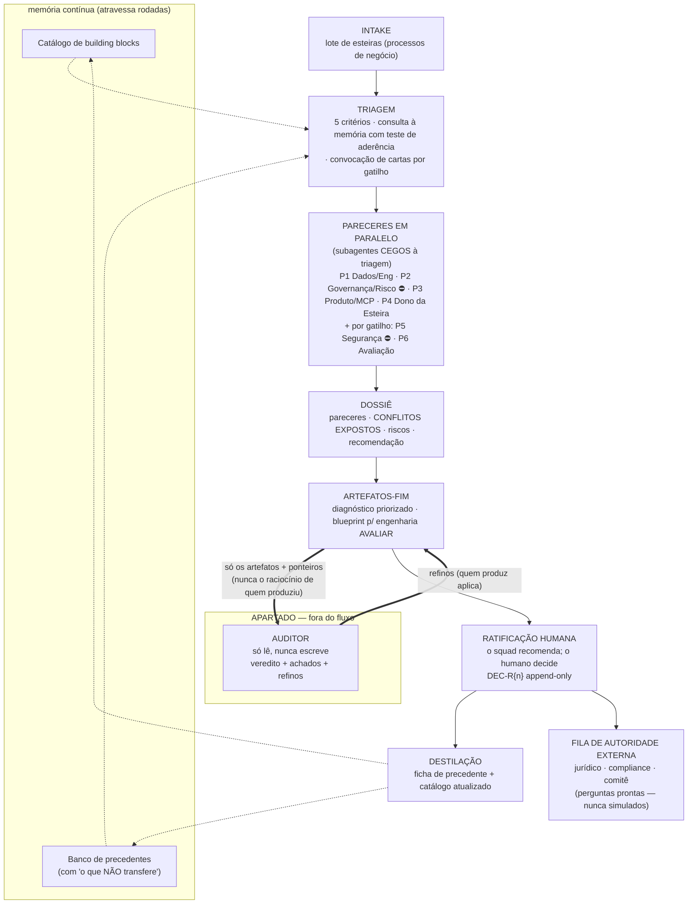

# squad-esteiras

**Squad Virtual de Aceleração de Esteiras** — uma skill que monta e roda um squad de especialistas virtuais de dados para deliberar, por rodada, quais esteiras (processos de negócio: crédito, seguro, cadastro, cobrança…) valem automatizar primeiro, e com que forma. O ponto central do desenho: a avaliação de qualidade não roda "no meio" do fluxo — roda **apartada**, num auditor independente que só lê, nunca escreve, e que não vê o raciocínio de quem produziu.

O squad **delibera e especifica; nunca executa** sobre caso real. O que sai de cada rodada é papel de engenharia:

1. **Diagnóstico priorizado** do lote, por 5 critérios explícitos (custo do erro, reversibilidade, volume × variância, reaproveitamento, clareza regulatória);
2. **Blueprint** de skill ou conector MCP, pronto para um time de engenharia avaliar;
3. Dois artefatos **contínuos**, que atravessam rodadas: o **catálogo de building blocks** (capacidades reaproveitáveis) e o **banco de precedentes** (investigações reaproveitáveis — cada esteira deliberada destila uma ficha com o problema-tipo, a solução, as condições recorrentes e, obrigatoriamente, **o que não transfere**).

A métrica declarada da skill: automatizar N esteiras é trabalho; fazer a esteira N+1 custar menos que a N, porque as anteriores viraram bloco e precedente, é plataforma. E a trava que acompanha a memória: precedente é hipótese a desafiar — todo reúso exige teste de aderência por escrito, e o auditor caça analogia forçada.

## O rito de uma rodada, em um desenho

O desenho carrega as três escolhas que definem a skill: o auditor **fora** da caixa (não "lá no meio" do workflow), os pareceristas **cegos** ao juízo de quem orquestra, e a memória contínua que faz a esteira N+1 custar menos que a N.

## Por que a auditoria roda apartada

Um avaliador embutido no workflow compartilha contexto com quem produz, e um modelo que viu o raciocínio do produtor tende a continuá-lo, não a testá-lo. Aqui a avaliação é um órgão, não uma etapa: o auditor roda em contexto novo, com charter fixo (`references/auditor_apartado.md`), recebe só os artefatos prontos + ponteiros, e devolve veredito, achados e um prompt de correção — sem jamais escrever nos artefatos. A versão de firewall máximo (auditor em projeto separado, sessão isolada, idealmente outro modelo) está documentada como escotilha no `SKILL.md`.

## Ordem de leitura

| # | Arquivo | O que é |
|---|---------|---------|
| 1 | [`SKILL.md`](SKILL.md) | A skill inteira: vocabulário, o squad, o fluxo da rodada em 7 fases, as 4 travas, a escotilha e os limites. |
| 2 | [`kit/PERSONAS/`](kit/PERSONAS/) | As 6 cartas de papel — mesa fixa de 4 (arquitetura de dados, governança e risco, produto/MCP, dono da esteira) + 2 convocadas por gatilho objetivo (segurança adversarial; ciência de dados e avaliação). Cada carta: missão, pergunta-assinatura, poderes e checklist vinculante. |
| 3 | [`references/auditor_apartado.md`](references/auditor_apartado.md) | O charter do auditor (Princípio Zero: só lê). |
| 4 | [`kit/TEMPLATES/`](kit/TEMPLATES/) | Dossiê, diagnóstico, blueprint, catálogo, registro de decisões e ficha de precedente. |
| 5 | [`kit/EXEMPLO/RODADA-DEMO/`](kit/EXEMPLO/RODADA-DEMO/) | **A primeira rodada, executada de verdade** — comece pelo [`LEIA-ME.md`](kit/EXEMPLO/RODADA-DEMO/LEIA-ME.md). |
| 6 | [`prototipo/`](prototipo/) | **O blueprint da rodada 1 virado código**: conector MCP + workflow + skill, testados sobre dados sintéticos (8/8). O trecho prototipação→produtização do ciclo. |
| 7 | [`kit/EXEMPLO/RODADA-2/`](kit/EXEMPLO/RODADA-2/) | **A segunda rodada** — cegamento auditável, mesa de 6 por gatilho, precedente consumido com teste de aderência, e um desfecho diferente: devolução para instrução. Comece pelo [`LEIA-ME.md`](kit/EXEMPLO/RODADA-2/LEIA-ME.md). |
| 8 | [`DE-30-A-800.md`](DE-30-A-800.md) | Como isto escala para um portfólio de centenas de esteiras — hipótese rotulada, com a métrica que diria se está funcionando. |

## Sobre os exemplos (a parte que vale mais)

Nenhuma das duas rodadas foi redigida para parecer que rodou — elas **rodaram**. Na primeira (`RODADA-DEMO`), cada parecer saiu de um subagente de contexto novo, o dossiê expõe 3 conflitos reais, e a auditoria apartada pegou dois achados de fidelidade que o produtor não tinha visto — aplicados como notas append-only. Na segunda (`RODADA-2`), o rito rodou completo: pareceristas cegos à triagem (com a instrução de spawn registrada para o cegamento ser auditável), P5 e P6 convocadas por gatilho, o precedente da rodada 1 consumido **e corrigido** pelos pareceristas, e um desfecho que carimbo nenhum produz: devolução para instrução, porque a regra de negócio central nunca foi escrita. Entre as duas, o blueprint da rodada 1 virou o [`prototipo/`](prototipo/) — código com testes verdes. Os logs dos auditores estão nas pastas `Auditoria/` de cada rodada.

⚠️ **Todas as esteiras dos exemplos são fictícias**, criadas para a demonstração, e estão rotuladas como tal em todos os artefatos. Nenhuma descreve processo real de nenhuma instituição.

## Como rodar

A skill foi escrita para um ambiente Claude com suporte a skills e subagentes (Claude Code / Cowork): instale a pasta como skill (ou o pacote `.skill`) e peça uma rodada sobre um lote de esteiras — o intake (`kit/INTAKE/I01`) conduz as ~5 perguntas iniciais. Sem esteiras reais documentadas, a skill roda com esteiras fictícias rotuladas: é uma trava de honestidade, não uma limitação.

## Origem e limites

Adaptação, para o domínio de esteiras de dados, do método de organizações virtuais das skills `criar-estudio-simples`/`criar-estudio-robusto` do autor — arquitetura exercitada em organizações que deliberam sobre trabalho, nenhuma delas operando ato sobre cliente real sob volume. O que a skill transfere é o aparato de governança da deliberação; que isso acelere uma esteira real é hipótese a testar, não resultado. Os demais limites estão declarados no fim do `SKILL.md`.

---
*Daniel Corral · agosto/2026 · [termos de uso](LICENSE)*
